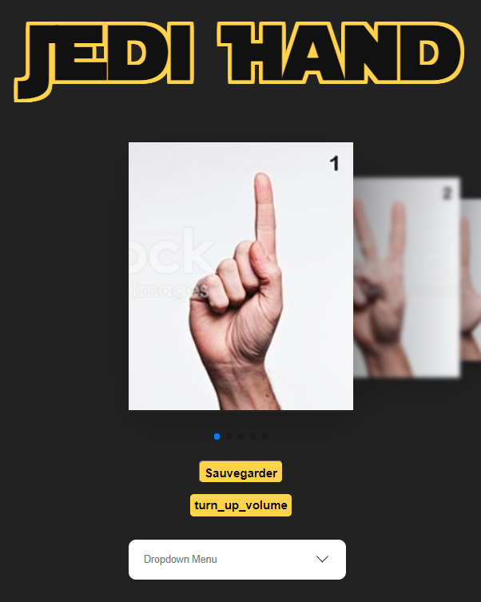
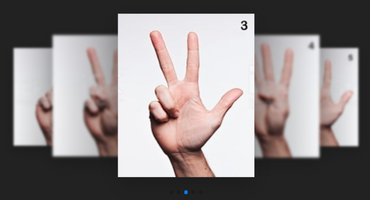
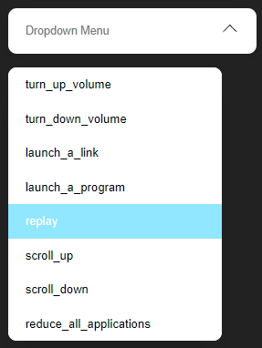

# JediHand
Projet Semestre 10 Master 2 TNSID - Système de détection des mains et applications de commandes sur le système - DeepLearning - Python

 

## FrontEnd :
Concernant le frontend c'est un site internet qui se lance en exécutant le fichier app.py qui se trouve dans le dossier frontend.

On allant sur l'ip obtenu grâce à l'exécution, nous nous retrouvons sur cette page :

De cette page, nous pouvons faire glisser sur la droite ou la gauche pour sélectionner la figure, comme ceci :

En dessous des images nous avons un bouton "Sauvegarder", le nom de la commande associé à l'image, et un menu déroulant qui va afficher les commandes possibles que l'on peut associer à l'image. 
Pour associer une figure à une commande, on doit cliquer sur le menu déroulant, sélectionner une commande en cliquant dessus. 
Pour sauvegarder ces changements, il suffit de cliquer sur le bouton "Sauvegarder".

