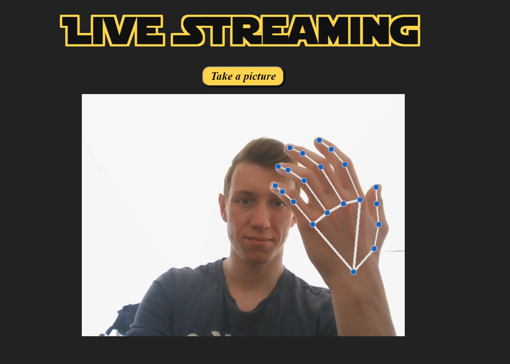

# JediHand
Projet Semestre 10 Master 2 TNSID - Système de détection des mains et applications de commandes sur le système - DeepLearning - Python

 

## FrontEnd (privilégié le navigateur FireFox):
Concernant le frontend c'est un site internet qui se lance en exécutant le fichier app.py qui se trouve dans le dossier app.

On allant sur l'ip obtenu grâce à l'exécution, nous nous retrouvons sur cette page, avec une explication du projet : 

### Page d'index :

A partir de cette page index, on peut se déplacer sur les différentes pages grâce au menu navigation à droite.

 

### Nous avons plusieurs choix : 
  * Cliquer sur Yoda : nous arrivons sur page index
  * Cliquer sur le rouage : nous arrivons sur la page de configuration
  * Cliquer sur l'image : nous arrivons sur la page live streaming
  * Cliquer sur le fichier : nous arrivons sur la page liste des signes
  * Cliquer sur le logo Github : nous arrivons sur la page Github du projet.

### Page de configuration :

1. Nous pouvons faire glisser sur la droite ou la gauche pour sélectionner le bon signe, comme ceci : 

2. En dessous des images nous avons un bouton "Sauvegarder", le nom de la commande associé à l'image, et un menu déroulant qui va afficher les commandes possibles que l'on peut associer à l'image. 
Pour associer une figure à une commande, on doit cliquer sur le menu déroulant, sélectionner une commande en cliquant dessus. 
Pour sauvegarder ces changements, il suffit de cliquer sur le bouton "Sauvegarder".
3. Lorsque la commande associé est "launch_a_program" ou "launch_a_link", il faudra entre une option dans le rectangle blanc qui vient d'apparaître :
 * Lancer un programme : exemple ( C:\Windows\System32\notepad.exe )
 * Lancer un lien : exemple ( youtube.com )

### Page de live streaming :

1. Nous obtenons un rendu de la caméra.
2. Nous pouvons cliquer sur le bouton "Take a Picture" afin d'être redirigé vers une page pour prendre en photo un signe de la main et le stocker dans la base de données. 

### Page d'ajout d'un signe :

1. A partir de cette page, il faut faire un signe de la main devant la caméra afin d'obtenir un squelette de la main.
2. Si le signe a bien était réalisé et/ou détecté, nous pouvons enregistrer ce signe dans la base de données en lui donnant un nom en cliquant sur "Save in DB". 

### Page d'affichage des signes :

Cette page n'a pour unique but que d'afficher les signes présent dans la base de données. 

## BackEnd :

### Initialisation du projet :

1. Télécharger l'ensemble de données provenant de ce site web : https://public.roboflow.com/object-detection/american-sign-language-letters
2. Deziper, et placer les fichiers à l'endroit suivant : JediHand-main/app/static/default-datas
3. Le contenu de default-datas doit ressembler à :  

4. Démarrer le container avec la base de données MongoDB, voire Readme du dossier docker.
5. Exécuter une première fois le fichier app.py : JediHand-main/app
6. Une fois le serveur démarrer, se rendre sur le site web afin de transférer les images des 26 signes de l'alphabet dans la base de données (cette étape peut prendre quelques minutes)
7. Executer le fichier db_initializer2.py : JediHand-main/app/lib (cela va créer une nouvelle collection d'images test dans la base de données afin de mesurer la précision).

Une fois l'initialisation terminée, nous pouvons utiliser cette application.

### Utilisation du projet :

1. (optionnel) Si besoin de supprimer une collection de la base de données il y a le fichier dropdatabase.py : JediHand-main/app/lib
2. Utiliser les appels de fonctions execute_function.py afin d'utiliser la Version 1 ou bien la Version 2 du projet (seule celle-ci permet d'exécuter des commandes): JediHand-main/app/lib/modules

